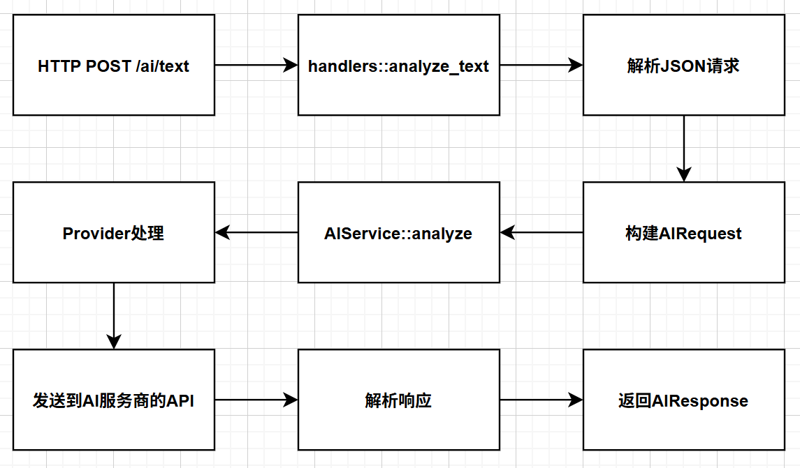
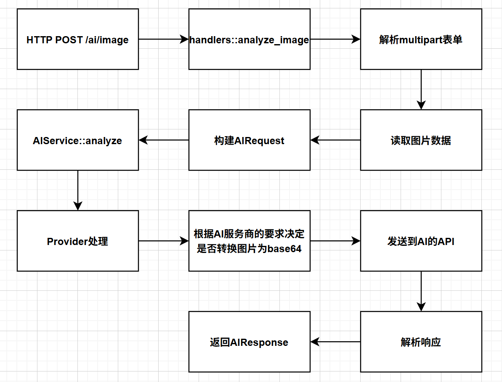

# AI Module API Documentation (Full Version)

## Interface Description

### 1. Text Analysis Interface



- **Request Example**:
```bash
curl -X POST http://localhost:8080/ai/text -H "Content-Type: application/json" -d "{\"input\":{\"type\":\"Text\",\"content\":\"What are you best at?\"},\"model\":\"qwen-turbo\"}"
```
- **Response Example**:
```json
{"content":"I am best at handling various text-related tasks...","confidence":null,"raw_response":{"output":{"finish_reason":"stop","text":"I am best at handling various text-related tasks..."},"usage":{"total_tokens":53,"output_tokens":40,"input_tokens":13}}}
```

### 2. Image Analysis Interface



- **Request Example**:
```bash
curl -X POST http://localhost:8080/ai/image -F "image=@image.png" -F "prompt=Please analyze the content of this image" -F "model=qwen-vl-max"
```
- **Response Example**:
```json
{"content":"This image shows a fruit beverage...","confidence":null,"raw_response":{"output":{"choices":[{"finish_reason":"stop","message":{"role":"assistant","content":[{"text":"This image shows a fruit beverage..."}]}}]},"usage":{"input_tokens_details":{"text_tokens":24,"image_tokens":128},"total_tokens":258}}}
```

## Response Field Description
- `content`: Main content generated by AI
- `confidence`: Confidence score (currently null)
- `raw_response`: Raw API response data (including token usage and other metadata)

## Environment Configuration
```bash
export AI_TONGYI_API_KEY="your_api_key"
```

## Notes
1. Image files must be in PNG/JPG format
2. Text interface supports a maximum of 8000 characters
3. Image size should not exceed 5MB
4. Error responses will return 4xx/5xx status codes